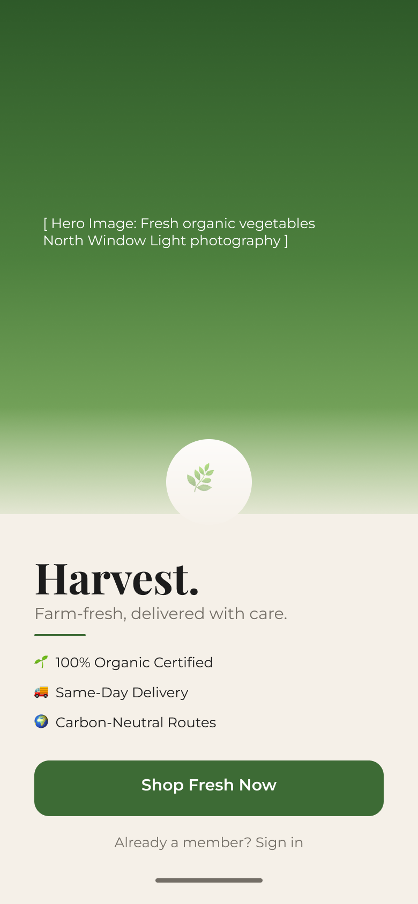
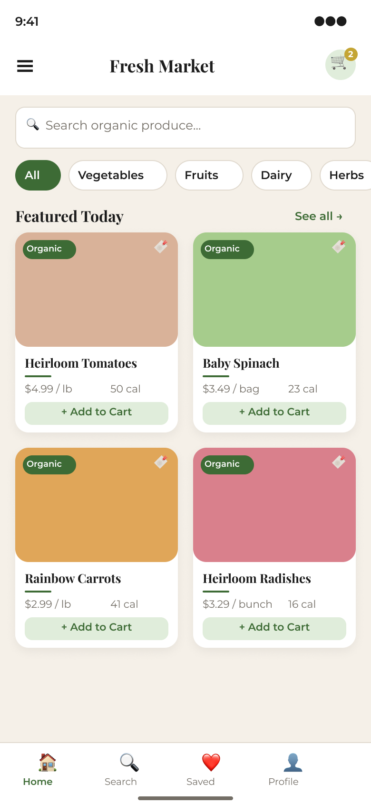
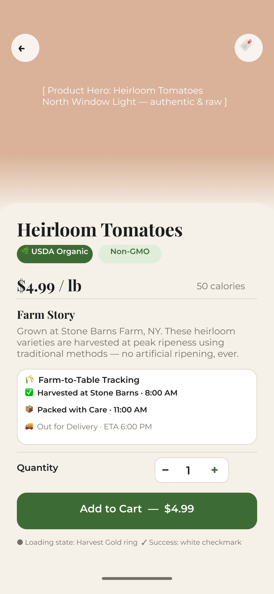
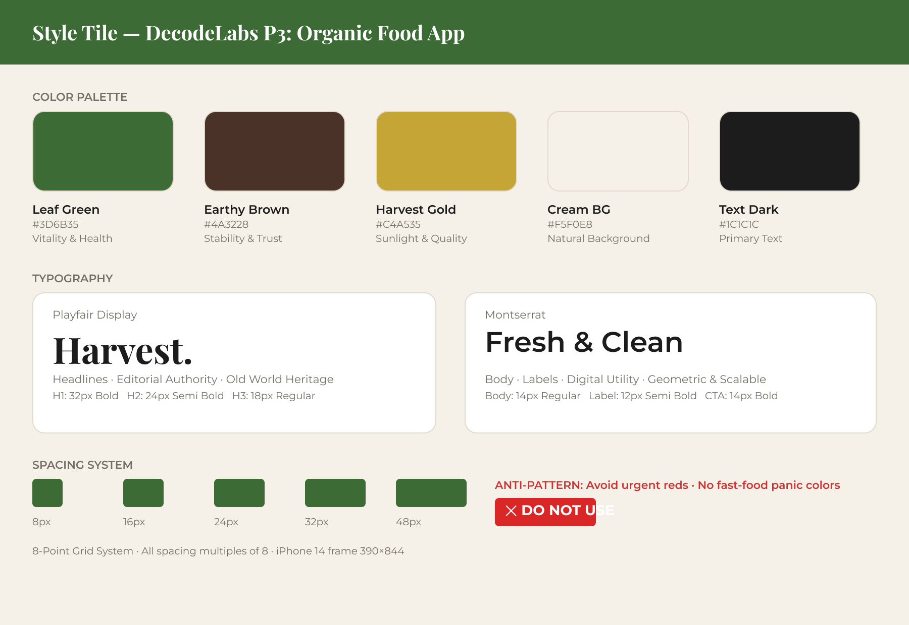

# 🌿 DecodeLabs UI/UX Internship — Project 3: The Visual Identity

**Batch:** 2026 | **Track:** UI/UX Design | **Designer:** Usman Ahmad

---

## 📌 Project Overview

A high-fidelity UI design for a premium **Organic Food Delivery** mobile app. The goal was to build a complete visual identity — color palette, typography system, and three key screens — that communicates trust, health, and speed through pure design, without a single line of code.

**Tool:** Figma
**Frame Size:** 390 × 844 px (iPhone 14)
**Grid System:** 8-Point Grid (all margins, padding, and spacing are multiples of 8)

---

## 🔗 Figma File

👉 **[View Full Design on Figma](https://www.figma.com/design/y6D05WsZSUYlX47Nt8jaTo)**

---

## 🎨 Style Tile

### Color Palette

| Swatch | Name | Hex | Role |
|--------|------|-----|------|
| 🟢 | Leaf Green | `#3D6B35` | Primary actions, CTAs, active states |
| 🟤 | Earthy Brown | `#4A3228` | Soil-to-table grounding, accents |
| 🟡 | Harvest Gold | `#C4A535` | Delight moments, loading states, badges |
| 🟫 | Cream BG | `#F5F0E8` | App background, content sheets |
| ⚫ | Text Dark | `#1C1C1C` | Primary text |
| ❌ | Urgent Red | `—` | **Anti-pattern: avoid. No fast-food panic.** |

### Typography

| Role | Font | Weight | Size |
|------|------|--------|------|
| Headlines | Playfair Display | Bold | 32–40px |
| Subheadings | Playfair Display | Semi Bold | 18–26px |
| Body | Montserrat | Regular | 14px |
| Labels / CTAs | Montserrat | Semi Bold | 11–14px |

> **Rationale:** Playfair Display signals editorial curation and old-world heritage. Montserrat provides geometric clarity for prices, nutrition data, and UI labels — friction-free reading at every size.

---

## 📱 Screens

### 1. Splash Screen
The brand entry point. Communicates premium quality and freshness before the user interacts with a single product.

- Full-bleed hero image area (North Window Light photography direction)
- Brand mark with leaf motif
- "Harvest." wordmark in Playfair Display Bold
- Three value propositions: Organic Certified · Same-Day Delivery · Carbon-Neutral Routes
- Full-width CTA: "Shop Fresh Now" (Leaf Green, 52px tall, 14px radius)



---

### 2. Product List
The browsing experience. Designed for discovery with maximum information density at minimum cognitive load.

- Top nav with cart badge (Harvest Gold)
- Search bar with 10px radius
- Horizontal category chips (active state: Leaf Green fill)
- 2-column product grid with drop shadow cards
- Each card: color-coded image placeholder, Organic badge, bookmark, product name (Playfair), price + calories (Montserrat), "+ Add to Cart" ghost button
- Bottom navigation bar (Home · Search · Saved · Profile)



---

### 3. Product Detail
The trust-building screen. Converts intent into purchase by showing provenance, certification, and transparency.

- Hero image with back + bookmark floating buttons
- Slide-up content sheet (cream, 24px corner radius)
- Product name + USDA Organic / Non-GMO badges
- Price and calorie info row
- "Farm Story" narrative section
- Farm-to-Table Tracking card (Harvested → Packed → Out for Delivery)
- Quantity selector with Earthy Brown / Leaf Green accents
- "Add to Cart — $4.99" CTA (Leaf Green, 52px)
- Micro-interaction note: Harvest Gold ring on load → white checkmark on success



---

### Style Tile Reference



---

## 🧱 Design Principles Applied

**Digital Hospitality** — UI provides warmth through personalized notes, surprise upgrades, and thoughtful touches that mirror a host's care.

**AI Personalization** — Interface architecture supports context-aware suggestions (e.g. "Rainy Day Comforts" when weather data indicates a downpour).

**Radical Transparency** — Carbon footprint and Green Delivery routing are visualized as standard features, not buried in settings.

**Accessibility** — Text contrast meets WCAG AAA (15.8:1 ratio for primary text on cream). Error states use shape + icon + text, never color alone. Minimum 4.5:1 contrast for all body text.

---

## 📂 Repository Structure

```
DecodeLabs-UIUX-P3/
├── README.md
└── assets/
    ├── style-tile.png
    ├── screen-splash.png
    ├── screen-product-list.png
    └── screen-product-detail.png
```

---


---

*Built as part of the DecodeLabs UI/UX Industrial Training Kit — Batch 2026*
